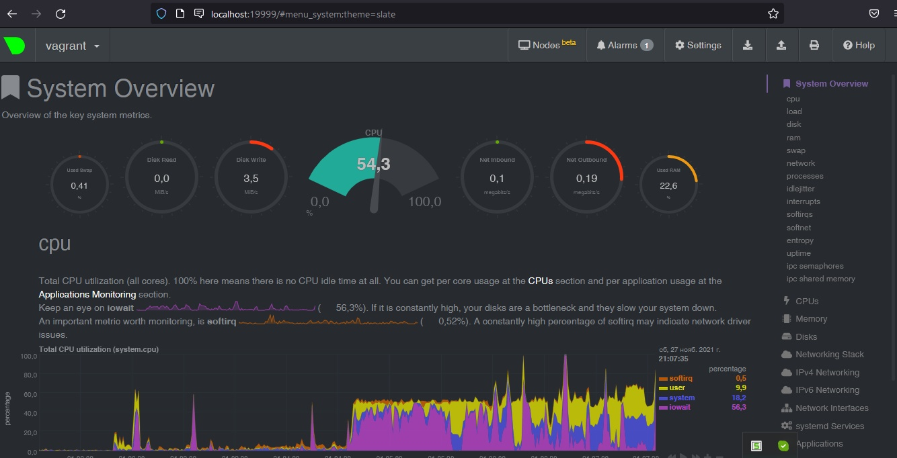

# Домашнее задание к занятию "3.4. Операционные системы, лекция 2"  

### 1. На лекции мы познакомились с [node_exporter](https://github.com/prometheus/node_exporter/releases). В демонстрации его исполняемый файл запускался в background. Этого достаточно для демо, но не для настоящей production-системы, где процессы должны находиться под внешним управлением. Используя знания из лекции по systemd, создайте самостоятельно простой [unit-файл](https://www.freedesktop.org/software/systemd/man/systemd.service.html) для node_exporter:

   * поместите его в автозагрузку,
   * предусмотрите возможность добавления опций к запускаемому процессу через внешний файл (посмотрите, например, на `systemctl cat cron`),
   * удостоверьтесь, что с помощью systemctl процесс корректно стартует, завершается, а после перезагрузки автоматически поднимается.

Поцесс установки думаю не надо описывать ) После распаковки архива создаю unit file для нового сервиса с таким содержимым:
```
[Unit]
Description=Prometheus exporter for hardware and OS metrics
Documentation=https://github.com/prometheus/node_exporter/blob/master/README.md

[Service]
EnvironmentFile=-/etc/default/node_exporter
ExecStart=/bin/bash -c /home/vagrant/node_exporter-1.3.0.linux-amd64/node_exporter* $OPTIONS
KillMode=process
Restart=on-failure
RestartSec=3

[Install]
WantedBy=multi-user.target
```
Позже выяснил что нужно было файл просто в бинарники кинуть и не мудрить со строкой ExecStart, но да ладно, и так работает.
Перезапускаю демон сервисов: sudo systemctl daemon-reload  
Стартую сервис: sudo systemctl start node_exporter  
Добавляю его в автозагрузку: sudo systemctl enable  node_exporter
Проверяю статус процесса:
```
sudo systemctl status node_exporter
● node_exporter.service - Prometheus exporter for hardware and OS metrics
     Loaded: loaded (/etc/systemd/system/node_exporter.service; enabled; vendor preset: enabled)
     Active: active (running) since Sat 2021-11-27 16:09:43 UTC; 21h ago
       Docs: https://github.com/prometheus/node_exporter/blob/master/README.md
   Main PID: 1341 (node_exporter)
      Tasks: 4 (limit: 1112)
     Memory: 2.3M
     CGroup: /system.slice/node_exporter.service
             └─1341 /home/vagrant/node_exporter-1.3.0.linux-amd64/node_exporter
```
После перезагрузки результат тот же, сервис работает, всё ок.


--- 

### 2. Ознакомьтесь с опциями node_exporter и выводом `/metrics` по-умолчанию. Приведите несколько опций, которые вы бы выбрали для базового мониторинга хоста по CPU, памяти, диску и сети.  

Вывод метрик переваливает за 1000 строк. Если даже грепнуть по "node_" то 928 строк получится. Количество измеряемых параметров довольно велико.  
Наиболее полезные в базовом наборе думаю будут такие:  
```
process_cpu_seconds_total
node_schedstat_waiting_seconds_total
node_pressure_cpu_waiting_seconds_total 
node_memory_Percpu_bytes
node_softnet_dropped_total
node_softnet_processed_total
node_memory_MemAvailable_bytes  
node_memory_MemFree_bytes  
node_memory_MemTotal_bytes
node_memory_SwapCached_bytes  
node_memory_SwapFree_bytes 
node_memory_SwapTotal_bytes  
node_netstat_Tcp_ActiveOpens
node_netstat_Tcp_CurrEstab
node_netstat_Tcp_PassiveOpens
node_network_flags
node_network_iface_id
node_network_iface_link
node_network_mtu_bytes
node_network_receive_bytes_total
node_network_speed_bytes
node_network_transmit_bytes_total
node_network_up
node_disk_io_time_seconds_total
node_disk_read_bytes_total
node_disk_read_time_seconds_total
node_disk_reads_completed_total
node_disk_write_time_seconds_total
node_disk_writes_completed_total
node_disk_written_bytes_total
```

---

### 3. Установите в свою виртуальную машину [Netdata](https://github.com/netdata/netdata). Воспользуйтесь [готовыми пакетами](https://packagecloud.io/netdata/netdata/install) для установки (`sudo apt install -y netdata`). После успешной установки:
   * в конфигурационном файле `/etc/netdata/netdata.conf` в секции [web] замените значение с localhost на `bind to = 0.0.0.0`,
   * добавьте в Vagrantfile проброс порта Netdata на свой локальный компьютер и сделайте `vagrant reload`:

    ```bash
    config.vm.network "forwarded_port", guest: 19999, host: 19999
    ```

   После успешной перезагрузки в браузере *на своем ПК* (не в виртуальной машине) вы должны суметь зайти на `localhost:19999`. Ознакомьтесь с метриками, которые по умолчанию собираются Netdata и с комментариями, которые даны к этим метрикам.

Получилось: 


---

### 4. Можно ли по выводу dmesg понять, осознает ли ОС, что загружена не на настоящем оборудовании, а на системе виртуализации?

Да, по очевидным сообщениям:
```
vagrant@vagrant:~$ dmesg > dmesg && cat dmesg | grep virtual*
[    0.002824] CPU MTRRs all blank - virtualized system.
[    0.083862] Booting paravirtualized kernel on KVM
[    2.683580] systemd[1]: Detected virtualization oracle.
```
---

### 5. Как настроен sysctl `fs.nr_open` на системе по-умолчанию? Узнайте, что означает этот параметр. Какой другой существующий лимит не позволит достичь такого числа (`ulimit --help`)?  

Хороший ответ [здесь](https://ru.stackoverflow.com/questions/475417/%D0%9B%D0%B8%D0%BC%D0%B8%D1%82-%D0%BD%D0%B0-%D0%BA%D0%BE%D0%BB%D0%B8%D1%87%D0%B5%D1%81%D1%82%D0%B2%D0%BE-%D0%BE%D1%82%D0%BA%D1%80%D1%8B%D1%82%D1%8B%D1%85-%D0%B4%D0%B5%D1%81%D0%BA%D1%80%D0%B8%D0%BF%D1%82%D0%BE%D1%80%D0%BE%D0%B2).  

цитата:
```
* Начать стоит с проверки ulimit -a и ulimit -aH в shell'е перед запуском вашего демона.  
Это быстро покажет текущие "мягкие" и (второй вызов) "жесткие" ограничения. При помощи ulimit  
можно открутить мягкие ограничения до пределов жестких. Следует понимать, что ulimit меняет только  
текущие лимиты, для шелла и всех программ, запущенных в этом шелле, поэтому после завершения сессии  
или даже в другом окне терминала значения останутся прежними.  

* Следующее место задания ограничений, на этот раз постоянных — это /etc/security/limits.conf  
и каталог /etc/security/limits.d/, ограничение называется nofile. Редактировать (а, иногда, и смотреть)  
эти файлы может только суперпользователь ("root"). Там задаются ограничения на отдельных пользователей  
или группы, применяемые на всю сессию данного пользователя, или всех пользователей определенной группы.  

* И наконец, есть "системное ограничение", задаваемое через sysctl - это fs.nr_open:  

/sbin/sysctl -n fs.nr_open
```
Дополню своими результатами:
```
root@vagrant:/home/vagrant# /sbin/sysctl -n fs.nr_open
1048576
root@vagrant:/home/vagrant# cat /proc/sys/fs/nr_open
1048576
root@vagrant:/home/vagrant# ulimit -a
open files                      (-n) 1024
root@vagrant:/home/vagrant# ulimit -aH
open files                      (-n) 1048576
root@vagrant:/home/vagrant# ulimit -Hn
1048576
root@vagrant:/home/vagrant# ulimit -Sn
1024
```
Примечание: 
Существует два типа ограничений: «жесткое ограничение» и «мягкое ограничение».  

  * «Жесткое ограничение» для открытых файлов статически заданное значение, и может быть изменен  
  только «корневым» пользователем Linux;  
  * «Мягкое ограничение» — это ограничение, которое может изменяться процессами динамически,  
  т. е. Во время выполнения, если процессу требуется больше открытых файлов, чем разрешено мягким пределом.  
Вот [здесь](https://cyber-x.ru/%D0%BA%D0%B0%D0%BA-%D0%B8%D0%B7%D0%BC%D0%B5%D0%BD%D0%B8%D1%82%D1%8C-%D0%BE%D0%B3%D1%80%D0%B0%D0%BD%D0%B8%D1%87%D0%B5%D0%BD%D0%B8%D0%B5-%D0%BD%D0%B0-%D0%BE%D1%82%D0%BA%D1%80%D1%8B%D1%82%D0%B8%D0%B5/) ещё хорошая информация по поводу настройки ограничений ulimit. 

---

### 6. Запустите любой долгоживущий процесс (не `ls`, который отработает мгновенно, а, например, `sleep 1h`) в отдельном неймспейсе процессов; покажите, что ваш процесс работает под PID 1 через `nsenter`. Для простоты работайте в данном задании под root (`sudo -i`). Под обычным пользователем требуются дополнительные опции (`--map-root-user`) и т.д.  

Делаем всё под root:
```
vagrant@vagrant:~$ sudo -i
```
Запускаем sleep через unshare:  
```
root@vagrant:~# unshare -f --pid --mount-proc sleep 1h
bg
^Z
[1]+  Stopped                 unshare -f --pid --mount-proc sleep 1h
root@vagrant:~# ps aux
USER         PID %CPU %MEM    VSZ   RSS TTY      STAT START   TIME COMMAND
root        9394  0.0  0.0   8080   592 pts/2    T    16:27   0:00 unshare -f --pid --mount-proc sleep 1h
root        9395  0.0  0.0   8076   528 pts/2    S    16:27   0:00 sleep 1h
root        9396  0.0  0.3  11492  3396 pts/2    R+   16:27   0:00 ps aux
```
Заходим в процесс:
```
root@vagrant:~# nsenter -t 9395 -p -m
root@vagrant:/# ps
    PID TTY          TIME CMD
      1 pts/2    00:00:00 sleep
      2 pts/2    00:00:00 bash
      9 pts/2    00:00:00 ps
```

---

### 7. Найдите информацию о том, что такое `:(){ :|:& };:`. Запустите эту команду в своей виртуальной машине Vagrant с Ubuntu 20.04 (**это важно, поведение в других ОС не проверялось**). Некоторое время все будет "плохо", после чего (минуты) – ОС должна стабилизироваться. Вызов `dmesg` расскажет, какой механизм помог автоматической стабилизации. Как настроен этот механизм по-умолчанию, и как изменить число процессов, которое можно создать в сессии?  

Это т.называемая `fork bomb` - функция fork рекурсивно вызывающая сама себя до тех пор пока не забьёт все ресурсы системы.  
dmesg сообщает:  
```
[Fri Nov 26 13:32:53 2021] cgroup: fork rejected by pids controller in /user.slice/user-1000.slice/session-3.scope
```
Здесь мы видим что сработал механизм сgroups - это способ ограничить ресурсы внутри конкретной cgroup(контрольной группы процессов).  
Параметры по умолчанию можно глянуть командой `ulimit -a`:
```
vagrant@vagrant:~$ ulimit -a
core file size          (blocks, -c) 0
data seg size           (kbytes, -d) unlimited
scheduling priority             (-e) 0
file size               (blocks, -f) unlimited
pending signals                 (-i) 3571
max locked memory       (kbytes, -l) 65536
max memory size         (kbytes, -m) unlimited
open files                      (-n) 1024
pipe size            (512 bytes, -p) 8
POSIX message queues     (bytes, -q) 819200
real-time priority              (-r) 0
stack size              (kbytes, -s) 8192
cpu time               (seconds, -t) unlimited
max user processes              (-u) 3571
virtual memory          (kbytes, -v) unlimited
file locks                      (-x) unlimited
```
А назначить новые параметры можно здесь: /etc/security/limits.conf
```
 cat /etc/security/limits.conf
# /etc/security/limits.conf
#
#Each line describes a limit for a user in the form:
#
#<domain>        <type>  <item>  <value>
#
#Where:
#<domain> can be:
#        - a user name
#        - a group name, with @group syntax
#        - the wildcard *, for default entry
#        - the wildcard %, can be also used with %group syntax,
#                 for maxlogin limit
#        - NOTE: group and wildcard limits are not applied to root.
#          To apply a limit to the root user, <domain> must be
#          the literal username root.
#
#<type> can have the two values:
#        - "soft" for enforcing the soft limits
#        - "hard" for enforcing hard limits
#
#<item> can be one of the following:
#        - core - limits the core file size (KB)
#        - data - max data size (KB)
#        - fsize - maximum filesize (KB)
#        - memlock - max locked-in-memory address space (KB)
#        - nofile - max number of open file descriptors
#        - rss - max resident set size (KB)
#        - stack - max stack size (KB)
#        - cpu - max CPU time (MIN)
#        - nproc - max number of processes
#        - as - address space limit (KB)
#        - maxlogins - max number of logins for this user
#        - maxsyslogins - max number of logins on the system
#        - priority - the priority to run user process with
#        - locks - max number of file locks the user can hold
#        - sigpending - max number of pending signals
#        - msgqueue - max memory used by POSIX message queues (bytes)
#        - nice - max nice priority allowed to raise to values: [-20, 19]
#        - rtprio - max realtime priority
#        - chroot - change root to directory (Debian-specific)
#
#<domain>      <type>  <item>         <value>
#

#*               soft    core            0
#root            hard    core            100000
#*               hard    rss             10000
#@student        hard    nproc           20
#@faculty        soft    nproc           20
#@faculty        hard    nproc           50
#ftp             hard    nproc           0
#ftp             -       chroot          /ftp
#@student        -       maxlogins       4

# End of file
```


